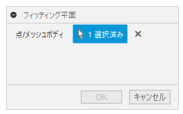

# **フィッティング平面**

本コマンドは、三個以上の点から平面を作成します。

---

## **使用法** :

「構築」パネルの平面の中にコマンドが追加されます。

クリックする事でダイアログが表示されます。

+ 点/メッシュボディ：平面作成に必要な点を3個以上又は、メッシュボディを選択します。
  + 選択可能な点は、"スケッチ点" "構築点" "ボディの頂点" "メッシュボディ" で、混在しての選択が可能です。
  + "メッシュボディ"については、メッシュの頂点を計算対象とします。

プレビューされます。良ければOKを押してください。

---

## **注意** :

- OSはWindowsのみが対象です。

---

## **アクション** :

以下の環境で確認しています。

- Fusion360 Ver2.0.16753
- Windows10 64bit Pro , Home

---

## **ライセンス** :

- MIT

---

## 謝辞 :

- [日本語フォーラム](https://forums.autodesk.com/t5/fusion-360-ri-ben-yu/bd-p/707)の皆さん、ありがとう。