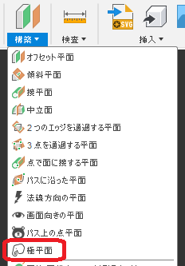
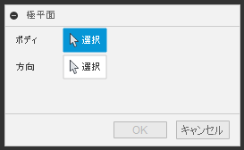
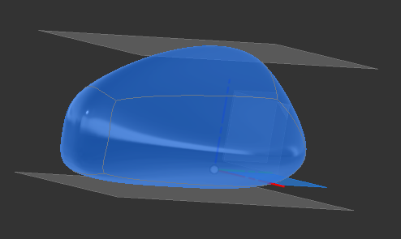

# **極平面**

本コマンドは、ボディと方向を指定し、極平面（方向に対してボディの最大・最小位置の平面）を作成します。

---

## **使用法** :

「構築」パネルの平面の中にコマンドが追加されます。

クリックする事でダイアログが表示されます。

+ ボディ：対象のボディを選択します。
+ 方向："スケッチ直線" "構築軸" "構築平面" "直線のエッジ" ”平らなボディの面” 等を選択します。

プレビューされます。良ければOKを押してください。

---

## **注意** :

- 特になし

---

## **アクション** :

以下の環境で確認しています。

- Fusion360 Ver2.0.13866
- Windows10 64bit Pro , Home

---

## **ライセンス** :

- MIT

---

## 謝辞 :

- [日本語フォーラム](https://forums.autodesk.com/t5/fusion-360-ri-ben-yu/bd-p/707)の皆さん、ありがとう。